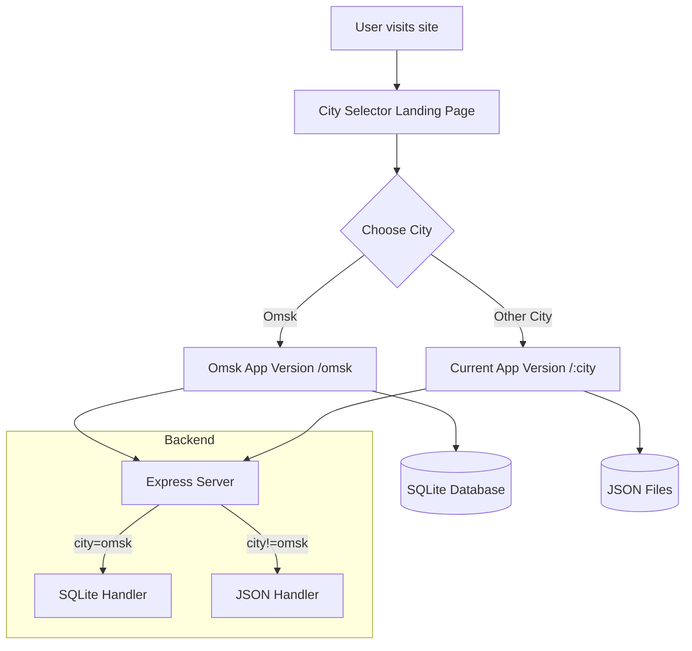

# Plan: Multi-City Site Separation (Omsk vs Other Cities)

## Overview
Create a landing page for city selection that routes users to:
- **Omsk**: New version with SQLite database + Metro-inspired minimalist flat dashboard UI + customizable color palettes
- **Other cities**: Current version using JSON files (untouched)

## Design Requirements for Omsk Version

### Metro-Inspired Minimalist Flat Dashboard UI
- **Flat design** - No shadows, gradients, or 3D effects
- **Clean geometric shapes** - Square/rectangular tiles, sharp edges
- **Bold typography** - Clear, readable fonts with good hierarchy
- **Grid-based layout** - Dashboard-style tile arrangement
- **Icon-driven** - Metro-style icons for navigation
- **Whitespace-focused** - Generous padding and spacing

### Color Palette System
- Users can select from predefined color palettes
- Palettes saved to localStorage for persistence
- Palettes include: primary color, accent color, background, text colors

## Architecture

## Implementation Steps

### 1. CitySelector Landing Page
- Create `src/components/CitySelector.tsx` - a dedicated landing page
- Display city cards/buttons for selection
- Route to `/omsk` for Omsk, to main app for other cities
- Make it the default route at `/`

### 2. Backend: SQLite Setup
- Add `better-sqlite3` dependency
- Create `src/database.js` - SQLite initialization and helpers
- Database schema:
  - `orders` table (id, employeeName, department, orderDate, items JSON, address, city, timestamp)
  - `menu_items` table (id, name, price, category, composition, etc.)
  - `menu_sides` table
  - `menu_config` table (categories)
  - `disabled_dates` table

### 3. Backend: Route Separation
- Modify `server.js` to detect Omsk requests
- Create separate API handlers:
  - `/api/omsk/*` → SQLite database
  - `/api/*` (other cities) → JSON files (unchanged)
- Keep the JSON storage completely untouched for other cities

### 4. Frontend: Color Palette System
- Create `src/theme/palettes.ts` - predefined color palettes
- Create `src/theme/ThemeContext.tsx` - React context for theme management
- Add theme selector UI component
- Persist selected palette to localStorage

### 5. Frontend: Metro UI Components (Omsk)
- Create Metro-styled components:
  - `MetroTile` - Flat tile component for dashboard
  - `MetroButton` - Flat button with no shadows
  - `MetroCard` - Simple flat card
  - `MetroGrid` - Grid layout for tiles
- Apply flat design principles throughout

### 6. Frontend Routing
- Update React Router in `App.tsx`:
  - `/` - CitySelector (new landing page)
  - `/omsk/*` - Omsk version (SQLite-backed, Metro UI)
  - `/:city` - Other cities (current version, JSON-backed)

### 7. Omsk Version
- Use Metro-style components
- Integrate color palette theming
- Point API calls to `/api/omsk/*` endpoints

### 8. Other Cities (Unchanged)
- Keep existing `/api/*` endpoints working
- Serve current UI as-is
- No changes needed in this version

## File Changes

### New Files
| File | Purpose |
|------|---------|
| `src/components/CitySelector.tsx` | Landing page for city selection |
| `src/database.ts` | SQLite initialization and queries |
| `src/theme/palettes.ts` | Color palette definitions |
| `src/theme/ThemeContext.tsx` | Theme context and provider |
| `src/components/ui/MetroTile.tsx` | Metro-style tile component |
| `src/components/ui/MetroButton.tsx` | Metro-style button component |
| `src/components/ui/MetroCard.tsx` | Metro-style card component |
| `src/components/omsk/*` | Omsk-specific pages |

### Modified Files
| File | Changes |
|------|---------|
| `package.json` | Add `better-sqlite3` dependency |
| `server.js` | Add SQLite handlers, route separation |
| `src/App.tsx` | Update routing, add theme provider |
| `src/api.ts` | Support Omsk-specific endpoints |
| `src/index.css` | Add Metro/flat base styles |

## Color Palette Options

Based on your requirements:

### 1. Sparxie Palette (Playing Cards Theme)
- Primary: Red (#E63946 or similar red)
- Secondary: Black (#1A1A1A)
- Background: White (#FFFFFF)
- Text: Black (#1A1A1A)
- Accent: Red (#E63946)

### 2. March 7th Palette (Ice Theme)
- Primary: Light Blue (#87CEEB or #74C0FC)
- Secondary: White (#FFFFFF)
- Background: White (#FFFFFF)
- Text: Dark Gray (#2D3748)
- Accent: Pink (#F687B3)

### 3. Classic Red (Current)
- Primary: #ff4139
- Secondary: #1a1a1a
- Background: #ffffff
- Text: #1a1a1a
- Accent: #ff4139

### 4. Dark Mode
- Primary: #6366f1
- Secondary: #4f46e5
- Background: #1a1a1a
- Text: #f5f5f5
- Accent: #818cf8

---

## Metro UI Design Principles

1. **No shadows** - Elements are flat
2. **No gradients** - Solid colors only
3. **Bold colors** - Use accent colors prominently
4. **Large touch targets** - Tiles should be easy to tap
5. **Clear typography** - Sans-serif fonts, good contrast
6. **Grid alignment** - Everything aligned to a grid
7. **Icons** - Use simple, bold icons

## Notes
- The two versions are served from the same domain
- Omsk uses `/omsk` prefix in URLs
- Both share the same Express server but different data backends
- JSON files remain untouched for other cities
- Color palette selection persists via localStorage
- You can fine-tune the exact hex colors later based on the reference images

## Metro UI Design Principles

1. **No shadows** - Elements are flat
2. **No gradients** - Solid colors only
3. **Bold colors** - Use accent colors prominently
4. **Large touch targets** - Tiles should be easy to tap
5. **Clear typography** - Sans-serif fonts, good contrast
6. **Grid alignment** - Everything aligned to a grid
7. **Icons** - Use simple, bold icons

## Notes
- The two versions are served from the same domain
- Omsk uses `/omsk` prefix in URLs
- Both share the same Express server but different data backends
- JSON files remain untouched for other cities
- Color palette selection persists via localStorage
